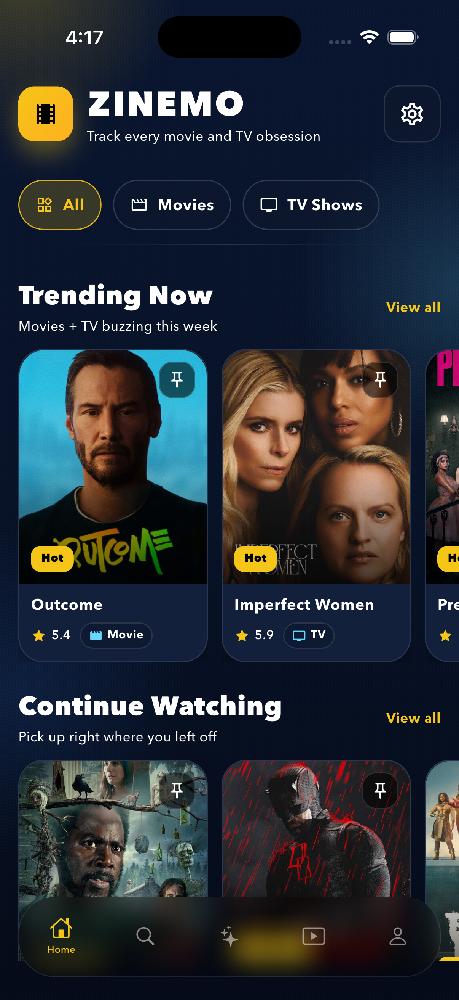

# Zinemo

Zinemo is a full-stack Movie + TV logging platform with personalized recommendations.

It combines:
- a Flutter mobile app (iOS/Android)
- a Node.js + Express backend API
- a Python FastAPI ML recommendation service
- Supabase (PostgreSQL + Auth + storage-ready schema)

## Quick Demo



## What Is Included

- Personalized recommendation feed with multiple recommendation modes
- Movie/TV discovery, search, detail, profile, logs, lists, and social-ready activity tracking
- ML service with LightFM/ALS/content-based hybrid and cold-start logic
- Supabase schema + migrations (including pgvector function)
- Render deployment config for API, ML service, and Redis

## Architecture

- Frontend ([frontend](frontend)) calls Backend API
- Backend ([backend](backend)) handles auth/content/recommendations and integrates with Supabase and TMDB
- ML service ([ml-service](ml-service)) serves recommendation/similarity endpoints and model training
- Database + auth are managed in Supabase via migrations under [supabase/migrations](supabase/migrations)

## Repository Structure

- [frontend](frontend): Flutter app
- [backend](backend): Node.js/TypeScript API
- [ml-service](ml-service): FastAPI ML microservice
- [supabase](supabase): DB config and migrations
- [render.yaml](render.yaml): Render service definitions

## Prerequisites

- Flutter SDK (Dart 3.11+)
- Node.js 20+
- Python 3.11
- npm
- Supabase project (URL + keys)

## Environment Setup

### 1) Backend

Use [backend/.env.example](backend/.env.example) as template.

Required values:
- SUPABASE_URL
- SUPABASE_SERVICE_ROLE_KEY (or SUPABASE_SERVICE_KEY in some configs)
- TMDB_API_KEY or TMDB_ACCESS_TOKEN
- REDIS_URL
- RECOMMENDATION_MODE (mode_a | mode_b | scratch)
- ML_SERVICE_URL

### 2) Frontend

Use [frontend/.env.example](frontend/.env.example) as template.

Required values:
- SUPABASE_URL
- SUPABASE_ANON_KEY
- API_BASE_URL
- ML_SERVICE_URL

Important: Flutter reads these via dart-define.

### 3) ML Service

Create [ml-service/.env](ml-service/.env) with:
- SUPABASE_URL
- SUPABASE_SERVICE_KEY
- MODEL_DIR (optional, default /tmp/zinemo_models)
- NODE_API_URL
- PORT (default 8000)

## Run Locally

Open 3 terminals from project root.

### Terminal A: Backend

```bash
cd backend
npm install
npm run dev
```

### Terminal B: ML Service

```bash
cd ml-service
python3.11 -m venv .venv
source .venv/bin/activate
pip install -r requirements.txt
.venv/bin/python -m uvicorn --env-file .env app.main:app --host 0.0.0.0 --port 8000
```

### Terminal C: Flutter App

```bash
cd frontend
flutter pub get
flutter run --dart-define-from-file=.env
```

## Recommendation Modes

Backend supports three modes via RECOMMENDATION_MODE:
- mode_a: TMDB-driven recommendation flow
- mode_b: Hybrid recommendation flow
- scratch: Python ML microservice flow

## Core API Surfaces

Backend:
- GET /health
- GET /api/content/*
- GET /api/recommendations/foryou
- GET /api/recommendations/similar/:tmdbId

ML Service:
- GET /health
- GET /recommend/{user_id}
- GET /similar/{tmdb_id}
- POST /train

## Database and Migrations

Supabase migration files are in [supabase/migrations](supabase/migrations).

To push migrations using backend tooling:

```bash
cd backend
npm run db:push
```

## Tests

Backend:

```bash
cd backend
npm test
```

Frontend:

```bash
cd frontend
flutter test
```

ML Service:

```bash
cd ml-service
pytest -q
```

## Deployment

Render services are defined in [render.yaml](render.yaml):
- zinemo-api (Node)
- zinemo-ml (Docker/Python)
- zinemo-redis

## Notes

- Keep secrets in environment files only.
- Do not commit real .env values.
- Use [backend/README.md](backend/README.md) and [ml-service/README.md](ml-service/README.md) for service-level deep details.
